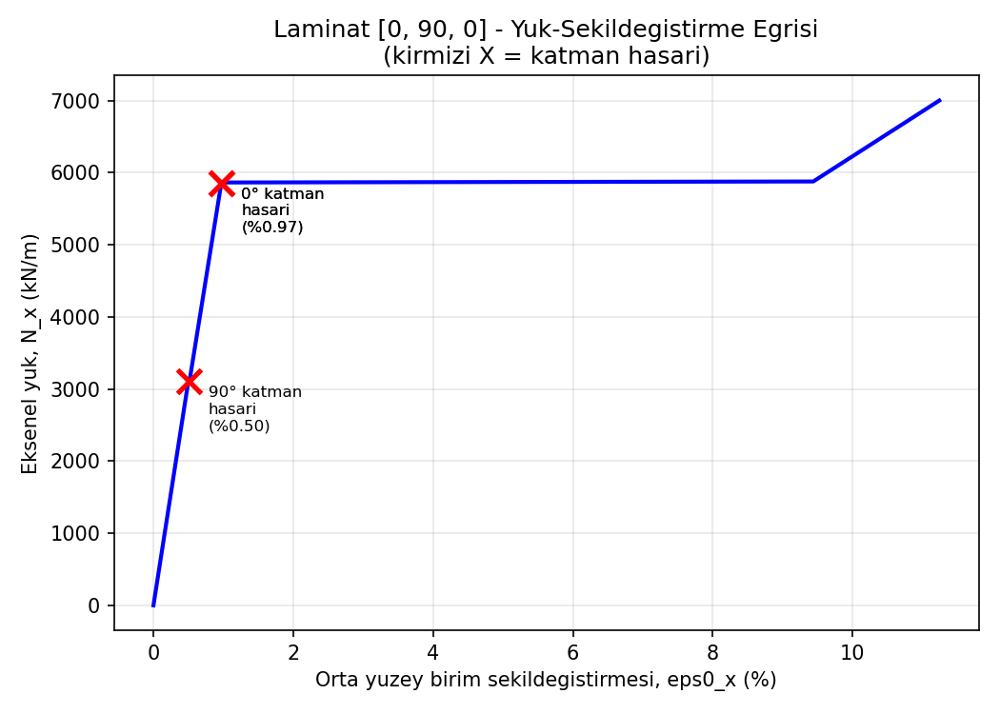
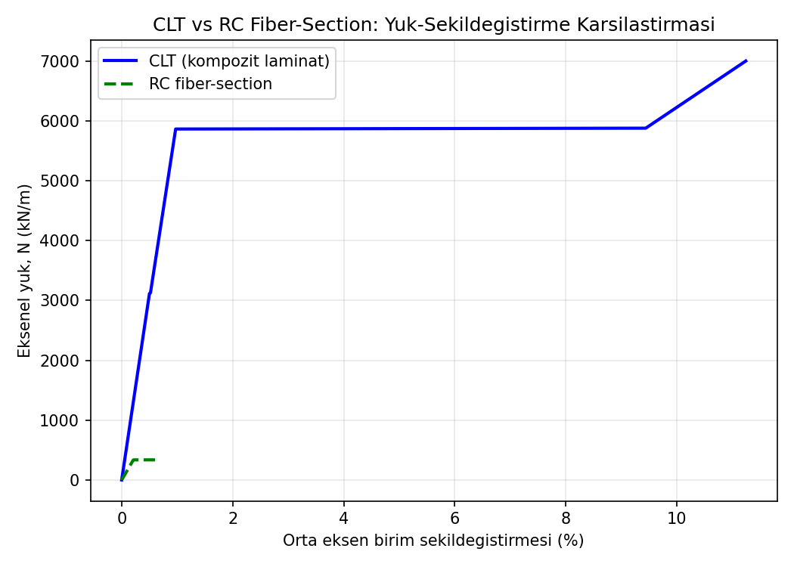

# Composite-Laminate-Progressive-Failure-Model-CLT-based

Python implementation of Classical Lamination Theory (CLT) combined with a
ply-discount progressive damage model, using the Tsai-Wu failure criterion.

## Motivation

This project originated from studying TBEC 2018 (Turkey Building Earthquake
Code, Chapter 5, "Rules for Modeling of the Structural System for Nonlinear
Analysis"), specifically the provisions on distributed (fiber-section)
nonlinear modeling of reinforced concrete shear walls, which are treated as
2D (shell/plate) elements discretized into fibers/cells through their
thickness.

Reinforced concrete is, in a mechanical sense, itself a composite material
(concrete matrix + steel reinforcement fibers), and the code's fiber-section
approach follows a discretize-into-layers, assign-a-nonlinear-material-law,
integrate-through-the-section pattern that is mathematically analogous to
Classical Lamination Theory (CLT) for fiber-reinforced composite laminates.
This project was built to explore that analogy from the composite mechanics
side: implementing CLT and a progressive, layer-wise damage model for a
composite laminate, independent of any specific FEA software.

**Scope note:** this is a self-directed exploratory implementation, not a
validated engineering tool. Material constants are sourced from Kaw, A.K.,
"Mechanics of Composite Materials," 2nd ed., CRC Press, 2006, Table 2.1
(Graphite/Epoxy, Vf=0.70; originally from Tsai & Hahn, "Introduction to
Composite Materials"), not calibrated to any specific commercial product,
and results have not been cross-checked against a commercial FE code or an
independent analytical solution.

## What it does

1. Builds the ply-level stiffness matrix (Q) from standard orthotropic
material constants (E1, E2, G12, nu12).
2. Transforms each ply to the laminate axis (Q_bar) for arbitrary fiber
angles.
3. Integrates through the laminate thickness to obtain the classical **A, B,
D** stiffness matrices.
4. Recovers ply-level stresses (sigma1, sigma2, tau12) in the fiber-aligned
frame for any applied in-plane load / moment resultant (N, M).
5. Applies the **Tsai-Wu** quadratic failure criterion per ply.
6. Runs a **progressive (incremental) loading** loop: at each load step,
checks every ply for failure, and applies a ply-discount stiffness
reduction (residual 10%) to any ply that fails, before continuing.
7. Recovers the laminate's load-strain response and the absorbed energy
(area under the curve) up to final failure.

## Example result

Laminate: [0/90/0], 2 mm plies, Graphite/Epoxy (Kaw Table 2.1: E1=181 GPa,
E2=10.3 GPa, G12=7.17 GPa, nu12=0.28).

| Event                                              | Load N_x   | Strain |
| --------------------------------------------------- | ---------- | ------ |
| First ply failure (90 deg layer, fiber-transverse) | ~3114 kN/m | ~0.50% |
| Final failure (0 deg layers)                       | ~5864 kN/m | ~0.97% |

Absorbed energy up to final failure: ~640 kJ/m (per unit width).


## CLT vs RC Uniform-Strain Section Model: Algorithmic Correspondence

**Naming note:** the underlying code (`build_fiber_section`, `fibers`) uses
"fiber-section" naming for consistency with standard RC analysis
terminology, but the current implementation only resolves axial load
(curvature phi = 0), so every fiber sees an identical strain regardless of
its position. This means the model is, in its present form, a
**uniform-strain section model** rather than a true fiber-section model —
the fiber discretization has no mechanical effect yet, since it does not
produce the through-depth strain gradient a real fiber-section analysis is
defined by. See "No through-depth or along-length distributed plasticity"
below.

To test the analogy described in the Motivation section, an independent RC
section model was implemented alongside the CLT model, sharing the same
discretize -> integrate -> check -> degrade algorithmic skeleton:

| Step | CLT (composite) | RC uniform-strain section |
|---|---|---|
| Discretize | Ply stack (angle, thickness) | Concrete/steel fibers through the section depth (currently all at equal strain) |
| Constitutive law | Q, Q_bar (linear elastic per ply) | Parabolic concrete law + elastic-plastic steel law |
| Integrate | A, B, D stiffness matrices | Axial force N(eps0) via direct fiber summation |
| Failure check | Tsai-Wu index >= 1.0, per ply | eps > eps_cu (crushing strain), per concrete fiber |
| Degrade | Ply stiffness reduced to 10% residual (ply-discount) | Failed fiber's contribution set to zero |

Both models flag failure explicitly at the element level (`l["failed"]` for
plies, `f["failed"]` for fibers) and recompute the section response with the
degraded state. **This is what the comparison actually tests: a local,
pointwise stiffness-loss bookkeeping mechanism shared at the code level** —
not a claim that the two materials behave alike, and not a full
distributed-plasticity beam-column element in the structural-analysis sense.

**Result:** the two models produce qualitatively different failure behavior,
which is the expected and physically correct outcome. The CLT laminate
degrades in discrete steps (each ply failure event visible as a small
stiffness drop) but keeps carrying load through the surviving plies. The RC
section instead shows a sudden, large capacity loss once the fibers cross
the concrete's ultimate crushing strain (eps_cu) — a brittle, near-total
loss of section capacity rather than a gradual stiffness reduction.


## Known Limitations

**Not a true fiber-section model (yet).** As noted above, curvature is
fixed at zero, so all fibers see the same strain. Extending this to a real
moment-curvature solve (phi != 0, solved jointly with eps0) is needed
before the fiber discretization does any mechanical work.

**Loading protocol mismatch.** The CLT curve is generated under
load-controlled loading (N prescribed, strain solved for), while the RC
curve is generated under displacement-controlled loading (eps0 prescribed,
N computed directly). This is a deliberate solver choice — the concrete's
post-crushing stress drop produces a non-monotonic N-eps0 relationship that
a load-controlled Newton-Raphson solver cannot follow through the
snap-back — but it means the two curves are not produced by the same
numerical procedure.

**No along-length distributed plasticity.** Even once through-depth strain
gradients are added, this would still be a single-section model. No
along-the-length distributed-plasticity element (multiple sections along a
member, as in a real TBEC 2018 fiber-section beam-column element) has been
implemented.

**No independent verification.** Neither the CLT nor the RC results have
been checked against a hand calculation, a known benchmark, or a commercial
FE/section-analysis tool. The absolute numbers (e.g., ~5336 kN/m section
capacity) should be treated as internally consistent outputs of this code,
not as validated engineering values.

**Simplified material models.** The concrete model has no confinement (no
distinction between confined/unconfined behavior), no tension stiffening
(concrete in tension is assumed to contribute nothing at all), and the
steel model is elastic-perfectly-plastic with no strain hardening.

**No N-M interaction.** Only axial load is resolved; the combined
axial-plus-bending case that governs real shear-wall behavior under seismic
loading is not yet implemented.

**Arbitrary section geometry.** The RC section dimensions (width=1.0 m,
height=0.20 m) and reinforcement (2 x 4 cm^2) were chosen to produce a
numerically reasonable example, not taken from an actual TBEC 2018 design
case or cross-checked against a minimum/typical reinforcement ratio.

**Duplicated failure-strain literal.** The concrete crushing strain
(eps_cu = 0.003) is currently written as a literal value in both
`concrete_stress()` and the failure check inside `section_force()`, rather
than sourced from a single shared parameter.

**No automated tests.** There are no unit tests to catch regressions as the
code evolves.

## Files

- `Untitled3 (1).ipynb` — Full analysis notebook: CLT core (Q, Q_bar, ABD
matrix), ply stress recovery, Tsai-Wu criterion, progressive loading loop,
energy calculation, RC uniform-strain section model, and CLT-vs-RC
comparison plotting.

## Requirements

```
numpy
matplotlib
```
